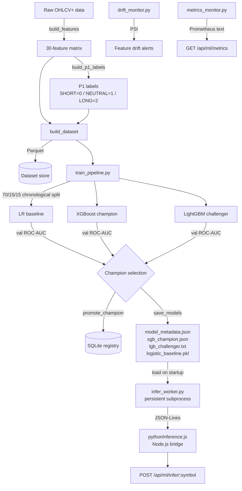
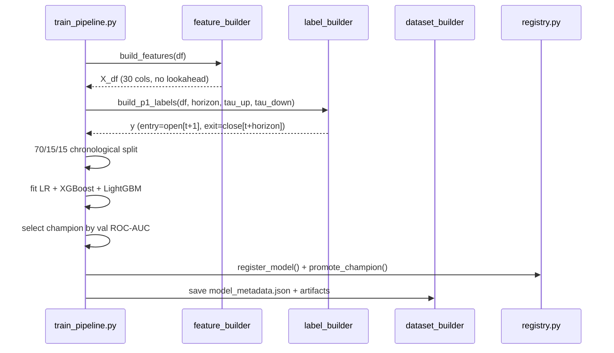
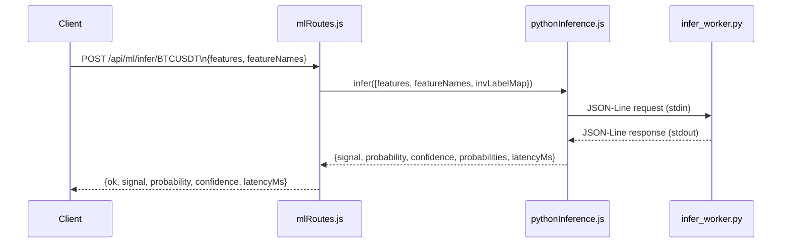

# ML Signal Engine — P1

Intraday three-class signal engine: **SHORT (0) / NEUTRAL (1) / LONG (2)**.

## Architecture



## Training pipeline



## Inference flow



## Feature families (30 features total)

| Family | Features | Count |
|---|---|---|
| PRICE_ACTION | ret_1, ret_5, ret_10, log_return, body_pct, upper_wick_pct, lower_wick_pct, range_pct | 8 |
| VOLATILITY | rolling_vol_5, rolling_vol_20, atr | 3 |
| VOLUME | rvol, volume_zscore, volume_delta | 3 |
| VOLUME_PROFILE | dist_poc, dist_vah, dist_val, inside_value_area | 4 |
| ORDERFLOW | spread, mid_price, queue_imbalance, bid_ask_pressure | 4 |
| FOOTPRINT | cvd, cvd_slope, footprint_imbalance_count, stacked_imbalance | 4 |
| SESSION | hour_sin, hour_cos, day_sin, day_cos | 4 |

## Label definition (P1 — no lookahead)

```
entry_price = open[t + 1]          # next bar open — realistic fill
exit_price  = close[t + horizon]

net_return = (exit_price - entry_price) / entry_price

LONG    (2) : net_return >= tau_up    (default +0.3%)
SHORT   (0) : net_return <= tau_down  (default -0.3%)
NEUTRAL (1) : otherwise
NaN         : last *horizon* rows — no complete future window
```

**inv_label_map**: `{"0": "SHORT", "1": "NEUTRAL", "2": "LONG"}`

## Split constraints

- **Temporal**: strict 70 / 15 / 15 — no shuffle, no data from the future
- **Cross-validation**: `TimeSeriesSplit(n_splits=5, gap=horizon)` — gap prevents any overlap between the last training bar and the first test bar within the same horizon window
- **Anti-leakage assertion**: `timestamps[train_end-1] < timestamps[train_end]` and `val_end - train_end >= horizon` enforced at runtime

## API endpoints

| Method | Path | Description |
|---|---|---|
| `POST` | `/api/ml/infer/:symbol` | Run inference for one bar |
| `GET` | `/api/ml/health` | Worker health + stats |
| `GET` | `/api/ml/model` | Champion model metadata |
| `POST` | `/api/ml/train` | Trigger background training run |

### POST /api/ml/infer/:symbol

Request body:
```json
{
  "features": { "ret_1": 0.0012, "atr": 0.0045, "rvol": 1.3 },
  "featureNames": ["ret_1", "atr", "rvol"]
}
```

Response:
```json
{
  "ok": true,
  "symbol": "BTCUSDT",
  "signal": "LONG",
  "probability": 0.712,
  "confidence": 0.712,
  "probabilities": { "SHORT": 0.091, "NEUTRAL": 0.197, "LONG": 0.712 },
  "latencyMs": 4.2,
  "modelVersion": "xgb@p1_v1"
}
```

## Performance targets

| Metric | Target |
|---|---|
| Inference p95 | < 500 ms |
| Worker restart limit | 3 attempts |
| Startup handshake timeout | 15 s |
| Request timeout | 400 ms (hard) |

## File inventory

```
server/ai/
├── training/
│   ├── feature_builder.py       # 30-feature engineering, no lookahead
│   ├── label_builder.py         # make_labels, create_labels, build_p1_labels
│   ├── dataset_builder.py       # build_dataset, load_dataset
│   ├── train_pipeline.py        # LR + XGBoost + LightGBM, 70/15/15 split
│   ├── dataset_utils.py         # temporal_train_val_test_split, time_series_cv
│   └── metrics.py               # evaluate_classification_metrics
├── inference/
│   ├── infer_worker.py          # persistent subprocess (JSON-Lines protocol)
│   ├── prediction_service.py    # PredictionService with watchdog + auto-restart
│   ├── infer.py                 # single-shot inference helper
│   └── champion_loader.py       # load champion from model_metadata.json
├── registry/
│   ├── registry.py              # ModelRegistry — SQLite, 5 tables
│   └── migrations/
│       └── 001_initial.sql      # DDL for MODEL_VERSION, TRAIN_RUN, …
├── monitoring/
│   ├── drift_monitor.py         # PSI-based feature + prediction drift
│   └── metrics_monitor.py       # latency p50/p95/p99, error rate, Prometheus
├── models/
│   ├── model_metadata.json      # champion descriptor (written by training)
│   ├── xgb_champion.json        # XGBoost booster
│   ├── lgb_challenger.txt       # LightGBM booster
│   └── logistic_baseline.pkl    # joblib LogisticRegression
└── tests/
    ├── test_labels.py           # 36 tests — label correctness & no-lookahead
    ├── test_training.py         # 29 tests — features, dataset, TimeSeriesSplit
    └── test_inference.py        # 39 tests — validation, PSI, metrics, E2E

server/api/
├── pythonInference.js           # Node.js bridge to infer_worker subprocess
└── mlRoutes.js                  # Express routes mounted at /api/ml

server/bootstrap/
└── runtimeIntegration.js        # registers /api/ml via mlRoutes
```

## Running the tests

```bash
python3 -m pytest server/ai/tests/ tests/ -v
```

Expected: **199 passing** (104 AI tests + 95 legacy tests).
